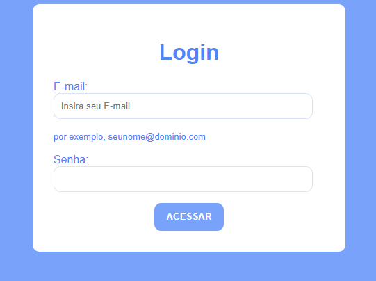

 ## Form Login
 * Criamos uma tela de login reutilizando codigos do trabalho [form-contato](https://github.com/dudafontinele/form-contato) e alteramos algumas informações de acordo com o que estava sendo pedido nessa tarefa.

## Objetivo
* O projeto tem objetivo de criar uma página de login utilizando HTML e CSS, contendo campos Email, senha e botão (acessar) 

## Autores
* Maria Eduarda Fontinele De Castro

## Fontes Utilizadas
* CSS, HTML

## Resultado
 